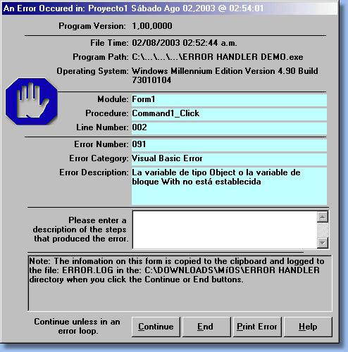



## Super Error Handler

### Description

A Super Error Handler, easy, fast, professional.
 
### More Info
 

             |
---                |---
**Submitted On**   |2003-07-09 13:13:24
**By**             |[José Luis Farías](https://github.com/Planet-Source-Code/PSCIndex/blob/master/ByAuthor/jos-luis-far-as.md)
**Level**          |Beginner
**User Rating**    |5.0 (10 globes from 2 users)
**Compatibility**  |VB 4\.0 \(32\-bit\), VB 5\.0, VB 6\.0
**Category**       |[Debugging and Error Handling](https://github.com/Planet-Source-Code/PSCIndex/blob/master/ByCategory/debugging-and-error-handling__1-26.md)
**World**          |[Visual Basic](https://github.com/Planet-Source-Code/PSCIndex/blob/master/ByWorld/visual-basic.md)
**Archive File**   |[Super\_Erro162300822003\.zip](https://github.com/Planet-Source-Code/jos-luis-far-as-super-error-handler__1-47330/archive/master.zip)

